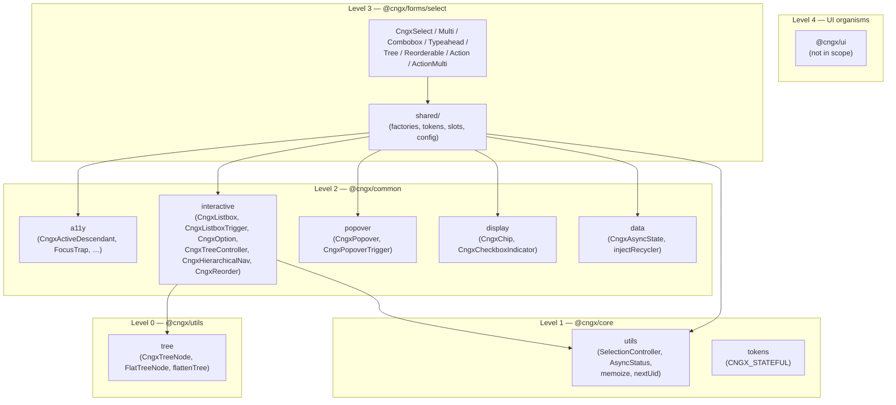
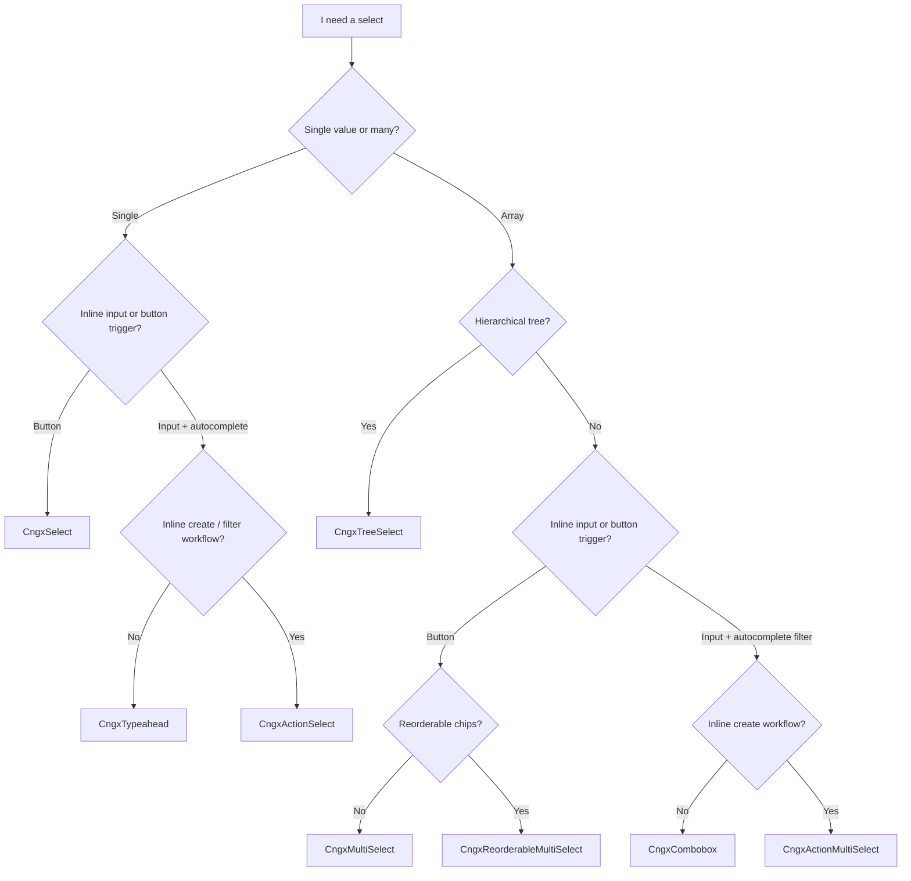
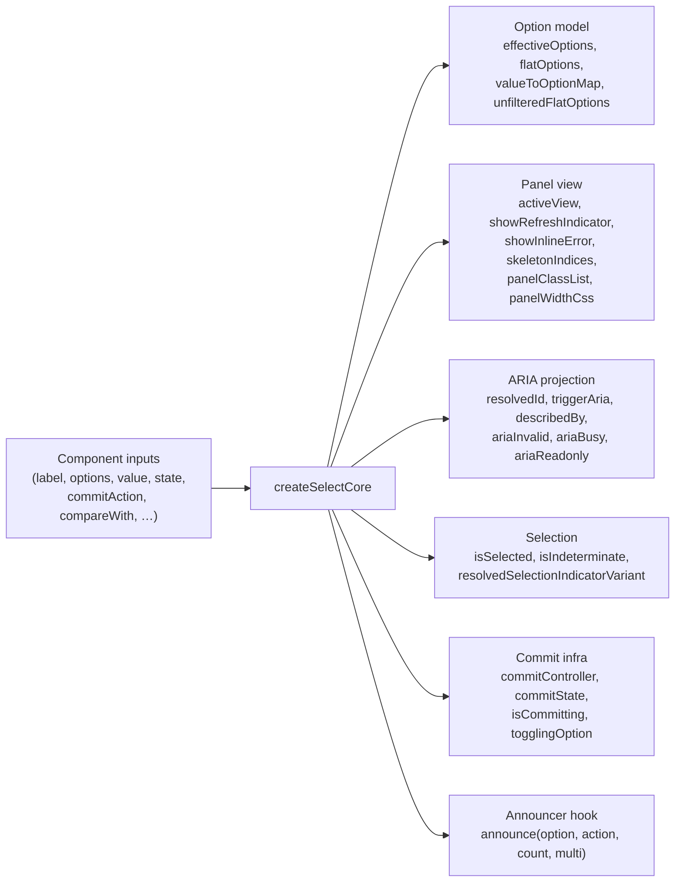
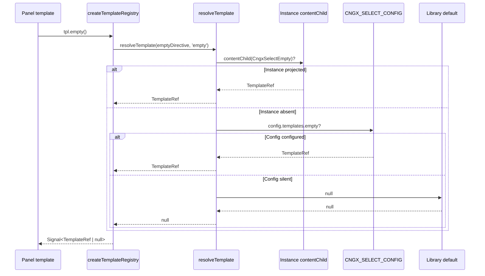
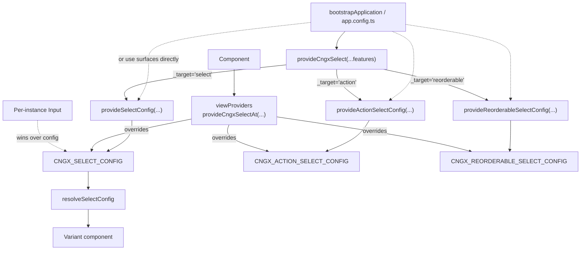
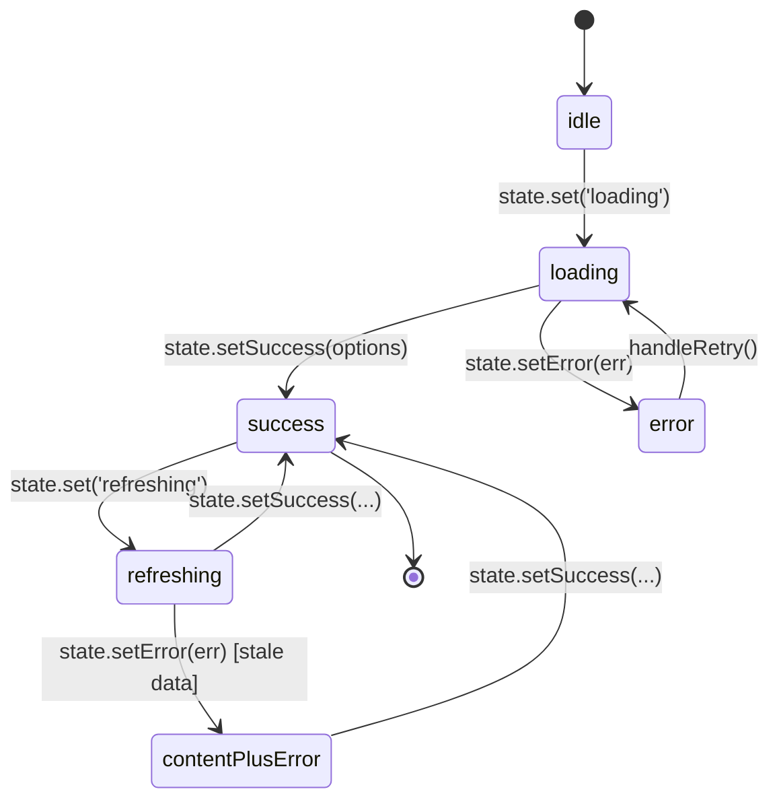
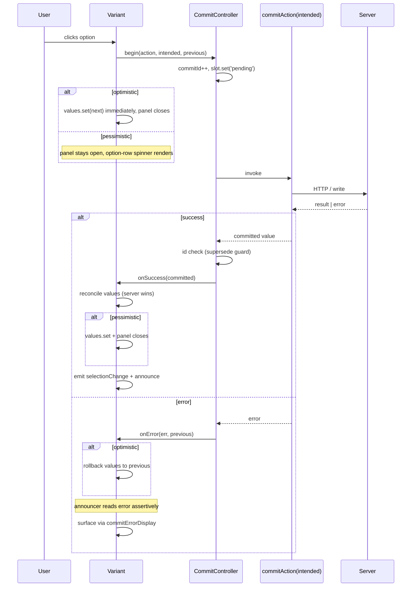
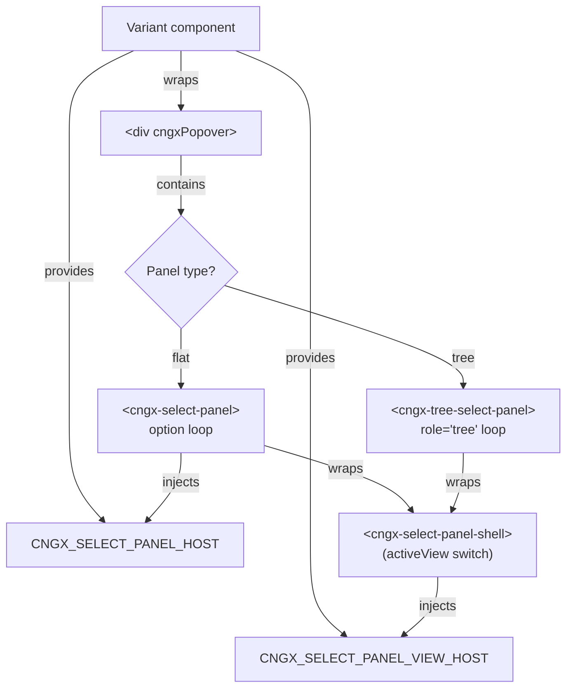

# `@cngx/forms/select` — Architecture

> The eight-component select family — single, multi, combobox, typeahead, tree, reorderable, action-select, action-multi-select.
> Same commit machinery, same async-state machine, same slot system, eight different value-shape × panel-surface combinations.

This document is the canonical entry point for understanding how the family is composed, where to override behaviour, and which variant to reach for.
For day-to-day API reference (inputs, outputs, signals, CSS variables) see the compodoc output (`npm run docs:serve`) or the in-source JSDoc.

---

## Table of contents

- [Mission statement](#mission-statement)
- [The eight variants](#the-eight-variants)
- [Layer composition](#layer-composition)
- [Pick-your-select decision guide](#pick-your-select-decision-guide)
- [Shared infrastructure](#shared-infrastructure)
  - [Core factory `createSelectCore`](#core-factory-createselectcore)
  - [DI factory tokens (18)](#di-factory-tokens-18)
- [Template slot system](#template-slot-system)
  - [The 17 public slots](#the-17-public-slots)
  - [Three-stage cascade](#three-stage-cascade)
  - [Internal `CNGX_SELECT_GLYPHS` const](#internal-cngx_select_glyphs-const)
- [Configuration cascade](#configuration-cascade)
- [Async state machine](#async-state-machine)
- [Commit-action lifecycle](#commit-action-lifecycle)
- [A11y model](#a11y-model)
- [Forms integration](#forms-integration)
- [Panel-shell + panel split](#panel-shell--panel-split)
- [Class size and decompose strategy](#class-size-and-decompose-strategy)
- [Tracked architectural debt](#tracked-architectural-debt)
- [How to extend](#how-to-extend)

---

## Mission statement

The select family delivers eight distinct widget shapes against three non-negotiable pillars from the cngx codebase philosophy:

1. **Derive over manage** — every reactive value is a `computed()` from
   a single source of truth. No subscription-driven local state, no
   manual sync between fields.
2. **Communication is architecture** — every state change emits to the
   appropriate channel: visual (DOM), semantic (ARIA), assistive
   (live region announcer). A11y is in the `computed()` graph, not
   bolted on.
3. **Composition over configuration** — small focused units.
   Eight components rather than one monolith with `[multiple]` /
   `[searchable]` / `[hierarchical]` flags. Every internal logic
   block is a swappable DI factory; every visual element is a
   slot-overrideable template.

The family is **decompose-ready** — every `@Component` is a thin declaration delegating to extracted factories so consumers can swap implementations without forking.

---

## The eight variants

| Component                    | Value shape      | Trigger                                     | Panel                      | ARIA pattern       |
| ---------------------------- | ---------------- | ------------------------------------------- | -------------------------- | ------------------ |
| `CngxSelect`                 | `T \| undefined` | `<div role="combobox">`                     | flat listbox               | combobox + listbox |
| `CngxMultiSelect`            | `T[]`            | `<div role="combobox">` + chips             | flat listbox               | combobox + listbox |
| `CngxCombobox`               | `T[]`            | `<input role="combobox">` + chips           | flat listbox (filtered)    | combobox + listbox |
| `CngxTypeahead`              | `T \| undefined` | `<input role="combobox">`                   | flat listbox (filtered)    | combobox + listbox |
| `CngxTreeSelect`             | `T[]`            | `<div role="combobox">` + chips             | tree (`role="tree"`)       | combobox + tree    |
| `CngxReorderableMultiSelect` | `T[]` (ordered)  | `<div role="combobox">` + reorderable chips | flat listbox               | combobox + listbox |
| `CngxActionSelect`           | `T \| undefined` | `<input>` + action panel                    | flat listbox + action slot | combobox + listbox |
| `CngxActionMultiSelect`      | `T[]`            | `<input>` + chips + action panel            | flat listbox + action slot | combobox + listbox |

Each variant provides `CNGX_FORM_FIELD_CONTROL` directly — no bridge directive needed. All eight share the same slot directives, the same config surface, the same announcer, and the same commit lifecycle.
What differs is the _value-shape adapter_ on top of `createSelectCore` and the _trigger-element template_.

---

## Layer composition

The family sits at Level 3 of the cngx dependency hierarchy (`@cngx/forms`). Each variant composes Level-2 atoms from `@cngx/common`:



A variant's `@Component` body is intentionally thin: it owns the template (with the variant-specific trigger markup) and the value-shape glue, then delegates everything else to the shared factories below.

---

## Pick-your-select decision guide



Live walkthrough is at `dev-app/.../select-compare-demo/`.

---

## Shared infrastructure

### Core factory `createSelectCore`

Every variant instantiates one `CngxSelectCore<T, TCommit>` in its field initialiser. The core is a plain factory (no `@Injectable`) that returns a bundle of pure-derivation signals every variant needs.



The core dispatches to `SelectionController<T>` for multi-mode membership tests (identity fast path, custom-comparator fallback) and holds the per-instance `commitController` instance.

What stays in the variant body:

- The trigger-element template.
- The value-shape adapter (single sets `value.set(v)`; multi calls
  `toggleOptionByUser(opt)`; tree calls `singleToggle(node)` /
  `cascadeToggle(node)`; reorderable handles position moves).
- Variant-specific output emissions (`selectionChange`,
  `optionToggled`, `cleared`, `reordered`).

### DI factory tokens (18)

Every shared factory has a corresponding DI token — providers can swap the default for telemetry-wrapped, retry-with-backoff, offline-queue, or audit-logging variants without forking any component.

| Token                                   | Default factory                | Concern                                                     |
| --------------------------------------- | ------------------------------ | ----------------------------------------------------------- |
| `CNGX_SELECT_COMMIT_CONTROLLER_FACTORY` | `createCommitController`       | Async-commit state machine + supersede semantics            |
| `CNGX_ARRAY_COMMIT_HANDLER_FACTORY`     | `createArrayCommitHandler`     | Multi/Combobox per-toggle + clear-all flow                  |
| `CNGX_SCALAR_COMMIT_HANDLER_FACTORY`    | `createScalarCommitHandler`    | ActionSelect commit flow                                    |
| `CNGX_REORDER_COMMIT_HANDLER_FACTORY`   | `createReorderCommitHandler`   | Reorderable position-move commits                           |
| `CNGX_CREATE_COMMIT_HANDLER_FACTORY`    | `createCreateCommitHandler`    | Action-host quick-create commit flow                        |
| `CNGX_DISPLAY_BINDING_FACTORY`          | `createDisplayBinding`         | Typeahead value ↔ input-text binding                        |
| `CNGX_COMMIT_ERROR_ANNOUNCER_FACTORY`   | `createCommitErrorAnnouncer`   | Scalar commit-error AT announce policy                      |
| `CNGX_TRIGGER_FOCUS_FACTORY`            | `createTriggerFocusState`      | Shared focus-state slot                                     |
| `CNGX_TEMPLATE_REGISTRY_FACTORY`        | `createTemplateRegistry`       | Three-stage template-slot cascade                           |
| `CNGX_PANEL_LIFECYCLE_EMITTER_FACTORY`  | `createPanelLifecycleEmitter`  | `panelOpen` → outputs + focus restore                       |
| `CNGX_SEARCH_EFFECTS_FACTORY`           | `createSearchEffects`          | `searchTerm` → debounced emit + auto-open                   |
| `CNGX_DISMISS_HANDLER_FACTORY`          | `createDismissHandler`         | Click-outside dismissal (action-dirty-aware)                |
| `CNGX_ACTION_HOST_BRIDGE_FACTORY`       | `createActionHostBridge`       | Action-host workflow bridge                                 |
| `CNGX_LOCAL_ITEMS_BUFFER_FACTORY`       | `createLocalItemsBuffer`       | Quick-create local-items persistence                        |
| `CNGX_PANEL_RENDERER_FACTORY`           | `createIdentityPanelRenderer`  | Panel render strategy (default = identity, opt-in recycler) |
| `CNGX_SELECTION_CONTROLLER_FACTORY`     | `createSelectionController`    | Multi-mode membership engine (in `@cngx/core/utils`)        |
| `CNGX_CHIP_REMOVAL_HANDLER_FACTORY`     | `createChipRemovalHandler`     | Chip ✕ disabled-guard + commit branch + WeakMap closure     |
| `CNGX_FLAT_NAV_STRATEGY`                | `createDefaultFlatNavStrategy` | PageUp/Down + typeahead-while-closed policy                 |

All eighteen tokens are `providedIn: 'root'` with sensible defaults, overrideable per-component via `viewProviders`.
The override never breaks because the factory shape is captured in a `Cngx<Name>Factory` type alias — overrides match the exact signature.

---

## Template slot system

Every visible piece of a select panel has an override slot.
The slot directives live in `shared/template-slots.ts` and project a typed context object so consumer markup can read live state.

### The 17 public slots

| Slot directive                                      | Where it renders                        | Context                                                                |
| --------------------------------------------------- | --------------------------------------- | ---------------------------------------------------------------------- |
| `*cngxSelectCheck`                                  | Selection-indicator next to each option | `{ option, selected, indeterminate, variant, position }`               |
| `*cngxSelectCaret`                                  | Trigger caret glyph                     | `{ open }`                                                             |
| `*cngxSelectOptgroup`                               | Group-header rows in the listbox        | `{ group }`                                                            |
| `*cngxSelectPlaceholder`                            | Trigger placeholder text                | `{ placeholder }`                                                      |
| `*cngxSelectEmpty`                                  | Panel "no options" body                 | `{ searchTerm, filtered, totalCount }`                                 |
| `*cngxSelectLoading`                                | First-load indicator body               | `{ progress?, retry }`                                                 |
| `*cngxSelectRefreshing`                             | Subsequent-load overlay                 | `{ previousCount }`                                                    |
| `*cngxSelectError`                                  | First-load error banner                 | `{ error, retry }`                                                     |
| `*cngxSelectCommitError`                            | Commit-error banner / inline            | `{ error, option, retry }`                                             |
| `*cngxSelectRetryButton`                            | Retry buttons across all 3 surfaces     | `{ retry, error, disabled, label }`                                    |
| `*cngxSelectLoadingGlyph`                           | Inner glyph of spinner/bar/dots         | `{}`                                                                   |
| `*cngxSelectClearButton`                            | Clear-all button                        | `{ clear, disabled }`                                                  |
| `*cngxSelectOptionLabel`                            | Option-row label rendering              | `{ option, selected, highlighted }`                                    |
| `*cngxSelectOptionPending`                          | Per-row commit-pending glyph            | `{ option }`                                                           |
| `*cngxSelectOptionError`                            | Per-row commit-error glyph              | `{ option, error }`                                                    |
| `*cngxSelectAction`                                 | Action panel slot (action-\* variants)  | `{ searchTerm, commit, close, isPending, dirty, retry, error, value }` |
| `*cngxSelectInputPrefix` / `*cngxSelectInputSuffix` | Input adornments (combobox + typeahead) | `{ disabled, focused, panelOpen }`                                     |

Variant-specific slots that complement the shared 17:

- `*cngxSelectTriggerLabel` (single only)
- `*cngxMultiSelectChip` (multi + reorderable)
- `*cngxMultiSelectChipHandle` (reorderable only — drag-handle override)
- `*cngxMultiSelectTriggerLabel` (multi)
- `*cngxComboboxChip` (combobox)
- `*cngxComboboxTriggerLabel` (combobox)
- `*cngxTreeSelectNode` (tree — node row override)
- `*cngxTreeSelectChip` (tree)
- `*cngxTreeSelectTriggerLabel` (tree)

### Three-stage cascade



The cascade is `Instance contentChild → CNGX_SELECT_CONFIG.templates.<key> → null`.
Variant components declare 13 `contentChild` queries inline (Angular's AOT compiler requires the call as a direct field initialiser — NG8110 rejects it from helper functions) and pass them as a bundle to `createTemplateRegistry {...})`. The factory wires each query through `resolveTemplate` to deliver the resolved `Signal<TemplateRef | null>` in one place.

### Internal `CNGX_SELECT_GLYPHS` const

Default glyphs for the slots that fall back to a single character (`✕ ▾ ▸ ⋮⋮ !`) live in `shared/glyphs.ts` as a plain `as const` object. **NOT exported** — the const exists only to absorb internal duplicates.
onsumers override via:

1. `*cngxSelectClearButton` / `*cngxSelectCaret` / `*cngxMultiSelectChipHandle` directives (highest precedence).
2. `[clearGlyph]` / `[caretGlyph]` / `[chipDragHandle]` Inputs (mid).
3. `CNGX_SELECT_GLYPHS.<key>` falls back automatically (lowest).

The library deliberately ships no `<cngx-icon>` / `<cngx-button>` component — we assume consumers bring their own design system.
The const stays tree-shakeable; calls drop from the bundle when unused.

---

## Configuration cascade

Three configuration surfaces feed the family. Each is provided by a matching `provideXxxConfig(...features)` function plus a `*At` component-scoped twin.
A unified `provideCngxSelect(...)` aggregator dispatches features across all three by inspecting the hidden `_target` discriminator on each feature.



Resolution priority for any setting (`panelWidth`, `dismissOn`,
`ariaLabels.clearButton`, etc.):

1. **Per-instance Input** (`[panelWidth]`, `[clearButtonAriaLabel]`).
2. **`provideCngxSelectAt(...)` in `viewProviders`** (component scope).
3. **`provideCngxSelect(...)` at app root** (or one of the three
   individual providers).
4. **Library default** (defined in `CNGX_SELECT_DEFAULTS`).

The `with*` features used inside `provide*` calls are typed so the
compiler catches typos and wrong-surface mixes within a single
`provideXxx` call. The aggregator widens the union to accept all
three feature types simultaneously.

Library defaults are English (`'Loading options'`, `'Save failed'`,
`'Reset selection'`, …). German consumers configure at bootstrap:

```typescript
provideCngxSelect(
  withAriaLabels({
    clearButton: 'Auswahl zurücksetzen',
    chipRemove: 'Entfernen',
    statusLoading: 'Lade Optionen',
    statusRefreshing: 'Aktualisiere Optionen',
    fieldLabelFallback: 'Auswahl',
    commitFailedMessage: 'Speichern fehlgeschlagen',
    treeExpand: 'Knoten erweitern',
    treeCollapse: 'Knoten reduzieren',
  }),
  withFallbackLabels({
    refreshFailed: 'Aktualisieren fehlgeschlagen',
    refreshFailedRetry: 'Nochmal versuchen',
    commitFailed: 'Speichern fehlgeschlagen',
    commitFailedRetry: 'Nochmal versuchen',
  }),
);
```

---

## Async state machine

The optional `[state]` input drives the panel view via `resolveAsyncView()` from `@cngx/common/data`.
The view is a discriminated union the panel-shell switches against.



`activeView()` resolves to one of `'skeleton' | 'content' | 'empty' | 'none' | 'error' | 'content+error'`.

The panel-shell renders:

| `activeView()`                             | Behaviour                                                                                  |
| ------------------------------------------ | ------------------------------------------------------------------------------------------ |
| `'skeleton'`                               | Full-panel loading body — variant from `loadingVariant` config (skeleton/spinner/bar/text) |
| `'empty'` / `'none'`                       | `*cngxSelectEmpty` slot or the configured fallback label                                   |
| `'error'` (first load)                     | `*cngxSelectError` slot or the default error banner with retry                             |
| `'content+error'` (stale + refresh failed) | Options visible + inline error above                                                       |
| `'content'` + `showRefreshIndicator()`     | Options visible + 2px shimmer overlay                                                      |
| `'content'` (no refresh)                   | Options visible only                                                                       |

Per-instance overrides: `[loading]` (boolean), `[loadingVariant]`, `[skeletonRowCount]`, `[refreshingVariant]`, `[retryFn]`.
The `(retry)` output fires on every retry click, letting consumers re-fetch.

---

## Commit-action lifecycle

Bind `[commitAction]` to a function returning `Observable | Promise | T | undefined` and the family routes user picks through it. T
wo modes, identical state machine.



**Supersede semantics.** Every `begin(...)` increments a monotonic
`commitId`. Outcome callbacks check their captured id against the
current counter; if a newer commit started in the meantime, the
callback no-ops. Consecutive picks therefore never race.

**Three error surfaces** controlled by `commitErrorDisplay`:

- `'banner'` (default) — `*cngxSelectCommitError` slot or a default alert banner above the option list.
- `'inline'` — a per-row `*cngxSelectOptionError` glyph on the failed option (visual-only, AT feedback via `announcer.announce(..., 'assertive')`).
- `'none'` — no built-in UI; bridge via `<cngx-toast-on />`,
  `<cngx-banner-on />`, or any `CNGX_STATEFUL`-aware transition component on the host.

The `commitState` signal is exposed via `CNGX_STATEFUL`, so transition bridges work with zero additional wiring.

---

## A11y model

Each variant follows the appropriate WAI-ARIA pattern.
Common properties are derived from the same `triggerAria()` projection on `createSelectCore`, ensuring identical behaviour across variants.

| Variant                                | Trigger element                                    | ARIA pattern                    |
| -------------------------------------- | -------------------------------------------------- | ------------------------------- |
| Single, Multi, TreeSelect, Reorderable | `<div role="combobox">`                            | combobox + listbox / tree popup |
| Combobox, Typeahead, Action\*          | `<input role="combobox" aria-autocomplete="list">` | inline-input combobox           |

The `<div role="combobox">` choice on the chip-carrying variants is deliberate: WAI-ARIA 1.2 forbids interactive children inside `<button>` (chip remove buttons would nest), so a `div` with a click handler fronts the combobox semantic.

**Live ARIA on the trigger** (sourced from `core.triggerAria`):
`aria-expanded`, `aria-controls`, `aria-disabled`, `aria-invalid`, `aria-required`, `aria-busy`, `aria-describedby`, `aria-errormessage`.
All are reactive computeds — they always reflect the current state, never go stale.

**TreeSelect's tree panel** uses `CngxActiveDescendant` (vertical nav)

- Home/End + typeahead) composed with `CngxHierarchicalNav`
  (ArrowLeft/Right collapse-and-traverse) on the same element — no double-fire because the two directives own disjoint key sets.
  Per-node `role="treeitem"` carries `aria-level`, `aria-posinset`, `aria-setsize`, `aria-expanded` (only on parents), `aria-selected`, `aria-disabled`, all reactive.

**Live region announcer.** `CngxSelectAnnouncer` is `providedIn: 'root'` and announces every selection change through a global polite live region.
`CngxSelectAnnouncerConfig.format()` builds the sentence; override for custom locales or sentence shapes.

**Focus restoration.** On panel close, focus returns to the trigger.
This lives in `createPanelLifecycleEmitter` (one factory across all variants), wrapped in a `queueMicrotask` so the focus write happens after the popover-close DOM mutation settles.

---

## Forms integration

The family is **Signal-Forms-first**. Every variant provides `CNGX_FORM_FIELD_CONTROL` directly — drop a `<cngx-XXX>` inside a `<cngx-form-field [field]="myField">` and bidirectional sync runs through `CngxFormFieldPresenter`.

Reactive Forms remain supported via the one-shot `adaptFormControl` adapter:

```typescript
import { adaptFormControl } from '@cngx/forms/field';

protected readonly rfControl = new FormControl<string>('green', {
  validators: [Validators.required],
  nonNullable: true,
});
protected readonly rfField = adaptFormControl(
  this.rfControl,
  'color',
  inject(DestroyRef),
);
```

Then bind the resulting `Field<T>` to `<cngx-form-field [field]="rfField">` exactly as for native Signal Forms.

`createFieldSync` (in `shared/field-sync.ts`) is the shared bridge — two `effect()`s install bidirectional `componentValue ↔ field.value()` sync, both directions guarded by `valueEquals` to suppress redundant writes.

---

## Panel-shell + panel split

The shared frame around every variant's panel body is `CngxSelectPanelShell` — owns the `activeView()` switch, the loading variants, the empty/error states, the refresh indicator, and the commit-error banner.
The variant projects only the variant-specific body (option loop / tree loop) via `<ng-content />`.



`CngxSelectPanelHost<T>` extends `CngxSelectPanelViewHost<T>`.
The narrower view-host contract is what the shell reads — keeps the shell value-shape-agnostic so `CngxTreeSelectPanel` and any future panel variant compose uniformly.
Tree-select provides BOTH tokens with `useExisting: self`.

---

## Class size and decompose strategy

The `@Component` body of each variant lands between 700 and 1100 LOC depending on value-shape complexity.
Sub-200-LOC targets are structurally unreachable under the locked patterns (no inheritance, no abstract base classes.
The 18 DI tokens + the slot system ARE the real decompose strategy: they eliminate cross-variant duplication and let consumers swap implementations.

**Atomic-decompose contract.** Each variant is decompose-ready:

- Thin `@Component` declaration.
- `hostDirectives: []` minimal — most variants use only the popover trigger directives.
- DI-token contracts for every internal logic block.
- CSS split: `select-base.css` (structural, family-shared) +`<variant>.component.css` (trigger skin). The schematic can eject the trigger skin into the consumer's project while keeping the base styles linked from the library.

**What is genuinely variant-specific** and does NOT factor out:

- Trigger template markup (button vs input vs chip-strip-with-input).
- Public API surface (single `value` vs `values: T[]` vs `treeValues`).
- AD-activation glue (the activated payload's shape varies).
- Field-sync wiring (single owns scalar `value`; multi/tree own arrays; typeahead owns `value + display.writeFromValue` integration).

Every other concern is shared.

---

## How to extend

A few representative extension paths.

**Add a new template slot.**

1. Add the directive class + context interface in `shared/template-slots.ts`.
2. Add the slot key to `CngxSelectTemplateContexts` and `CNGX_SELECT_DEFAULTS.templates` in `shared/config.ts`.
3. Add the slot to `CngxSelectTemplateRegistryQueries` + `CngxSelectTemplateRegistry` in `shared/template-registry.ts`, then wire `resolveTemplate(...)` inside `createTemplateRegistry`.
4. Each variant declares the corresponding `contentChild` and adds the field to the registry call.
5. Bind the resolved `host.tpl.<slot>()` in the panel template with an `@else` default.
6. Export the directive + context from `public-api.ts`.

**Add a new ariaLabels key.**

1. Add the optional field on `CngxSelectAriaLabels` in `shared/config.ts`.
2. Add the English default to `CNGX_SELECT_DEFAULTS.ariaLabels`.
3. Read it through `config.ariaLabels.<key> ?? '<English fallback>'` at the consumption site (variant or panel-shell).
4. Update `feedback_en_default_locale.md` is not needed — the EN convention is universal.

**Override an internal logic block enterprise-wide.**

1. Implement a custom factory matching the corresponding `Cngx<Name>Factory` type alias.
2. Provide it at app root:
   ```typescript
   {
     provide: CNGX_SELECT_COMMIT_CONTROLLER_FACTORY,
     useValue: <T>() => createMyTelemetryCommitController<T>({ ... }),
   }
   ```
3. Every select-family variant picks it up automatically.

**Add a ninth variant.**

1. Build the trigger template; pick the appropriate ARIA pattern.
2. Instantiate `createSelectCore<T, TCommit>` in a field initialiser.
3. Provide `CNGX_FORM_FIELD_CONTROL` (`useExisting: self`) and `CNGX_STATEFUL` for transition-bridge integration.
4. Provide `CNGX_SELECT_PANEL_VIEW_HOST` (and `CNGX_SELECT_PANEL_HOST` if the panel is option-loop-shaped); satisfy the contract.
5. Wire `CNGX_PANEL_LIFECYCLE_EMITTER_FACTORY`, `CNGX_TEMPLATE_REGISTRY_FACTORY`, and the appropriate commit handler factory.
6. Reuse the value-shape glue closest to your variant (`createArrayCommitHandler` for arrays, `createScalarCommitHandler` for singles, `createReorderCommitHandler` for ordered arrays).
7. Export the component + change-event interface from `public-api.ts`.
